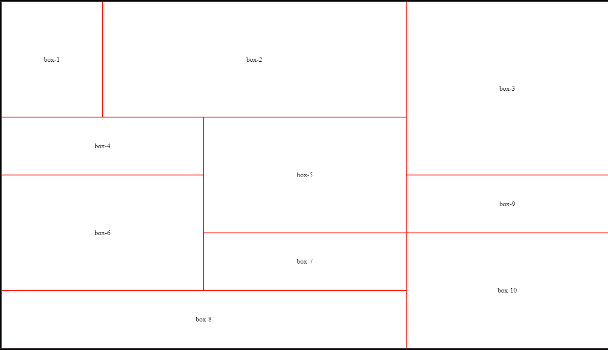
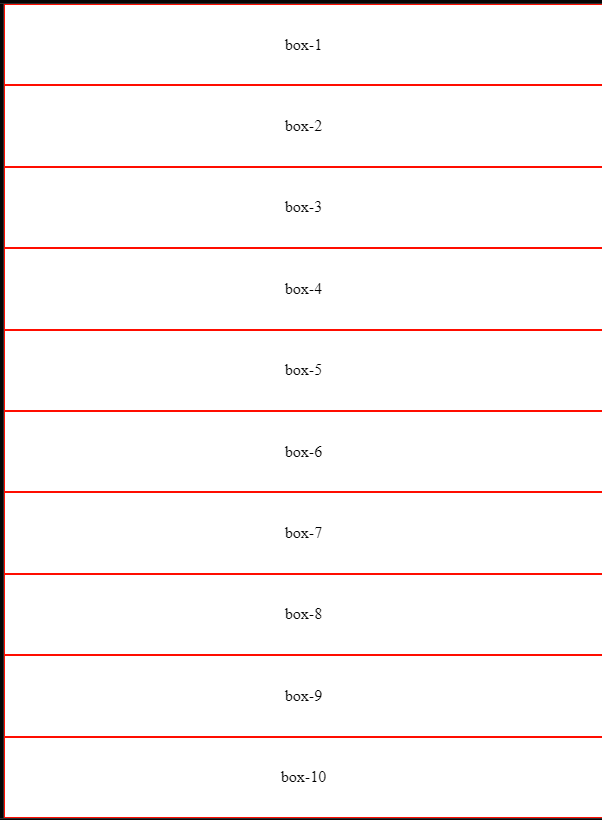
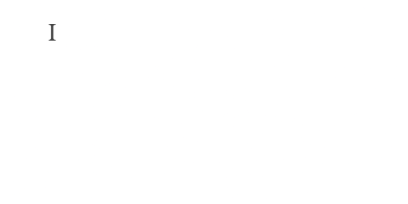
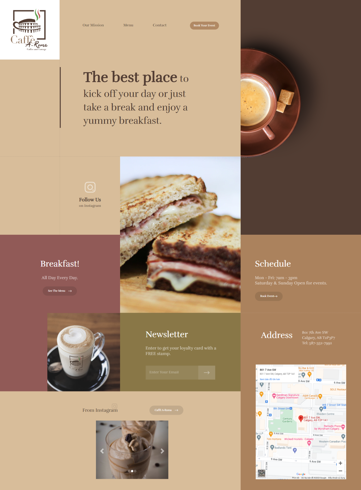
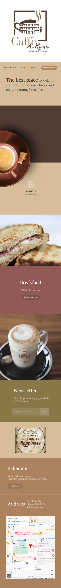

# Khoi-Le-Challenge

## Table of contents
* [Domain](#domain)
* [General info](#general-info)
* [Technologies](#technologies)
* [Final product](#Final-roduct)

## Domain
Site is live at https://khoingle.github.io/Khoi-Le-Challenge/

## General info
This project is to implement the mockup to match colors, typography, icons, sizing, and positioning while being mindful of the page behaviour on different screen resolution according to the [Figma layout](https://www.figma.com/file/EWY2sfxd5wBwirxgslaYeq/Technical-Challenge---Frontend-Web-Developer?node-id=0%3A1&t=j4Ipa0ddAH4KVF6a-1
)
  * Implement the layout using only HTML, SCSS, and Javascript
  * Do not use any CSS framework or library
  * The layout should be fluid 100%
  * Use relative sizing
  * Come up with the best mobile experience translating destop to mobile (The mobile version will scale down up to 375px wide)
  
## Technologies
Project is created with:
* HTML, SCSS, Javascript
* CSS Grid is tested on https://codepen.io/khoijacksinh/pen/qBMzNgZ?editors=1100
* Font text: https://fonts.google.com/specimen/Rufina
* Carousel plugin: https://www.w3schools.com/bootstrap/bootstrap_carousel.asp
* Embed Google map: https://developers.google.com/maps/documentation/embed/embedding-map
	
	
CSS Grid from Webpage to Mobile 

 

  :arrow_down:

  

  

	

## Final product:
* Webpage version (width: 1920px)

  

	
* Mobile version (width: 375px)

  

